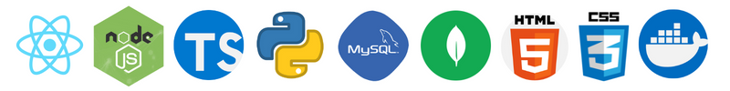

# Olá, seja bem-vindo(a) ao meu GitHub! :wave:
### Me chamo **Vitor Brandão** e sou um **Desenvolvedor Web Full Stack** formado na [Trybe](https://www.betrybe.com/).

Para ir direto ao ponto, aqui estão as **tecnologias** que venho estudando e praticando desde que comecei a estudar programação em **2020**:

Como você pode perceber, estou visando a formação como um **Desenvolvedor Full Stack**, uma vez que estou focado tanto em **Front-End** quanto no **Back-End** desde que comecei a estudar programação em 2020. 

Sinta-se à vontade para explorar meus **projetos** em meus **Repositórios** e analisar a forma como eu costumo programar, pois imagino que, se você veio até meu GitHub, meus **códigos** serão mais explicativos do que minhas palavras. 

Caso você esteja se perguntando: **"O que são exatamente os projetos** que você se refere?", eu explico. A formação em Desenvolvimento Web da Trybe é um curso de **30 horas semanais** (6h/dia), com duração de 1 ano, onde não apenas aprendemos as competências, mas também precisamos **consolidar esse conhecimento**. É nesse contexto que entram os projetos aos quais me refiro. Cada projeto possui uma lista de requisitos a serem cumpridos e **um prazo de uma semana para que 80% do projeto seja entregue**. 

Ao longo dessa jornada de aprendizado, desenvolvi cerca de **40 projetos dentro do prazo estabelecido**, ou seja, todos os projetos que você encontra em meus Repositórios foram desenvolvidos no período de uma semana - geralmente, a mesma semana em que o conteúdo foi ensinado. 

Como o GitHub é uma plataforma conhecida no mundo inteiro, opto por deixá-lo em inglês, da mesma forma que estou acostumado a nomear arquivos e variáveis de meus códigos também em inglês. Mas caso fique com alguma dúvida, sinta-se à vontade para **entrar em contato via e-mail ou Linkedin**, onde podemos conversar em português :blush:.

Skills
---------

> BACK-END
- **Node.Js** (ORM, Express, Rest API, MVC, JWT, Dotenv, Insomnia.rest, Tests);
- **TypeScript** (Oriented Object Programming, SOLID);
- **Python** (.Venv, Data Scraping, Json, Xml, Csv, Tests);
- **MySQL** (Sequelize, mysql2, JOINs, Workbench);
- **MongoDB** (Mongoose).

> FRONT-END
- **React** (SPA, Redux, Context API, Hooks, React Router, Tests);
- **JavaScript** (ES6, Fetch API, async/await, DOM, Tests);
- **HTML** (Semantic HTML5);
- **CSS 3** (Flexbox, Mobile First, Responsive Design);

> TESTS
- **Jest**;
- **React Testing Library (RTL)**;
- **Mocha, Chai and Sinon**;
- **Pytest**.

> DEPLOYMENT
- **Docker**;
- **Heroku**.

> OUTRAS TECNOLOGIAS 
- **npm**;
- **C**;
- **GitHub** (incluindo trabalhos em grupo e projetos em dupla);
- **Linux (Bash/Unix Shell)**;
- **Windows**;
- **Adobe Photoshop**.
- **Canva**;
- Estou acostumado a desenvolver utilizando **ES Lint** e **Flake8**.

> EXPERIÊNCIA PROFISSIONAL
- Possuo mais de 5 anos de experiência prévia no mercado de trabalho, em áreas não-relacionadas à tecnologia. Acessando meu **[Linkedin](https://www.linkedin.com/in/vitorbrandao-silva/)**, você pode encontrar mais informações. 
- **Bacharelado em Jornalismo** com distinção de primeiro grau, na Universidade do Vale do Rio dos Sinos (**Unisinos**).

> IDIOMAS
- **Português** (nativo);
- **Inglês** (99/120 Toefl iBT);
- **Espanhol** (intermediário).

---
# :us: Hello and welcome! :wave:

### My name is **Vitor Brandão**, I'm **brazilian** and here are some of the **programming skills** I've been studying and improving since **2020**:

As you can see, I am aiming to be a **Full-Stack Developer**, since I'm studying both **Front-End** and **Back-End**. In September of 2022, I am about to conclude my Full Stack formation **at [Trybe](https://www.betrybe.com/)**. In my Repositories you can find all the projects I have developed in this last year.

And you might ask: "But what are those projects you talk about?". Well, let me explain it better. The Web Development course at Trybe, whose duration lasts 1 year (30 hours/week), requires that students **not only learn the stacks but also practice them**. A Trybe Project is a GitHub Repository with test coverage whose ReadMe contains a **list of requirements** to be accomplished **within a week**. I'm very proud to say that I have successfully delivered **40 projects** before the deadline - not to mention that the projects were usually developed in the same week that the content was taught.    

Make yourself at home and feel free to search about these skills in my **Repositories**, because I imagine that, if you are visiting my GitHub, my codes may explain better than my words. 

> EXPERIENCE
- More than **5 years of work experience** (in non-technology related areas). In my **[Linkedin](https://www.linkedin.com/in/vitorbrandao-silva/)** you can find more details;
- **Bachelor's Degree in Journalism** with *first-honours degree* in Universidade do Vale do Rio dos Sinos (**Unisinos**).

> LANGUAGE PROFICIENCY
- **Portuguese** (native);
- **English** (99/120 Toefl iBT);
- **Spanish** (intermediary)

---

Informações de Contato
---------
:brazil: Sinta-se a vontade para entrar em contato comigo.

* Podemos conversar por e-mail: *vitorsbsilva@gmail.com*;

* Ou, se preferir, pelo **[Linkedin](https://www.linkedin.com/in/vitorbrandao-silva/)**.

:us: Feel free to **contact** me anytime.

* Here is my **e-mail** to contact me: *vitorsbsilva@gmail.com*;

* And here is my **[Linkedin](https://www.linkedin.com/in/vitorbrandao-silva/)**.

---

E aqui estão alguns dos projetos que já desenvolvi:
---------
